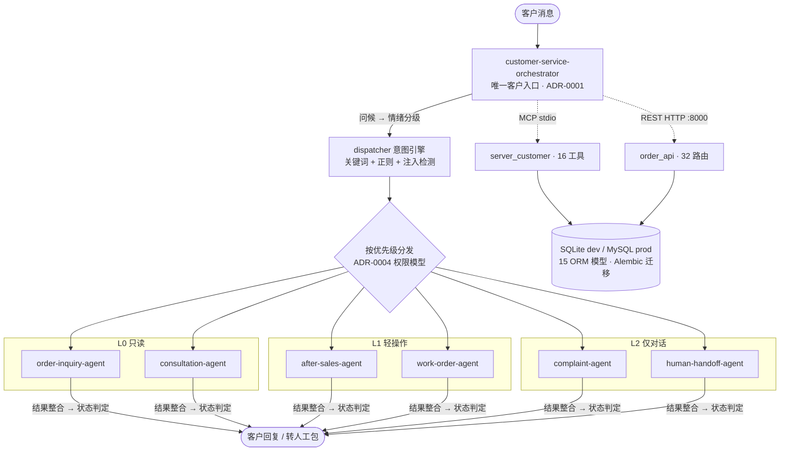

# 客服智能体 2.0 · Customer Service Agent 2.0

> 基于多 Agent 编排的智能客服系统 —— 单一入口编排、三级权限隔离、生产级可观测性。


---

## 项目亮点

这是一个**独立设计并完成**的生产级后端项目，覆盖从业务编排到部署运维的完整链路：

- **多 Agent 编排架构**：1 个 Orchestrator 作为唯一客户入口，经内部意图引擎分发到 6 个子 Agent，子 Agent 永不直连客户（ADR-0001）。
- **三级权限模型防 prompt 注入**：L0 只读 / L1 轻操作 / L2 仅对话，投诉与人工坐席 Agent 不接触任何业务系统，从架构上隔离注入风险，权限只能降级不能升级（ADR-0004）。
- **确定性运行时可无 LLM 测试**：编排规则是可执行 Python，而非纯 prompt。84 个测试在无 LLM 环境下跑完全部业务逻辑，覆盖率 76%。
- **框架中立适配器**：同一套编排逻辑既能经 MCP(stdio) 也能经 REST(HTTP) 暴露，传输层与业务逻辑完全解耦。
- **3 个真实并发缺陷的修复**：对话状态 OrderedDict 竞争、SQLite 无 WAL、幂等键 TOCTOU，每个都附带针对性并发测试。
- **完整可观测性栈**：structlog 结构化日志 + Prometheus 指标 + Grafana 仪表盘 + Alertmanager 告警，request_id 全链路追踪。
- **10 份 ADR 架构决策记录**：每个关键决策都有背景、方案、权衡与结论，决策可追溯。
- **5 阶段迭代工程**：从 P1 生产加固到 P5 并行测试，测试套件运行时间从 63s 降至 13s（5x 加速）。

---

## 它解决什么问题

电商客服场景下，一条客户消息往往同时包含多个意图（"我要退款并且投诉这个订单"），且不同业务操作的风险等级差异极大——查订单是只读，发起退款会改数据，而投诉应当直接转人工、不应让 Agent 触碰业务系统。

本项目用一个编排层统一处理这些问题：识别情绪与意图、按优先级分发到权限受限的子 Agent、整合结果、必要时打包转人工。客户始终只与一个入口交互，内部复杂度被封装在编排层之后。

---

## 系统架构



### 消息处理主循环

每条客户消息经过一个 9 步确定性流水线，全程可测试、可观测：

```
handle_message(customer_message)
  1. 空消息              → 返回问候语
  2. 情绪分级            → L3(自杀/暴力)立即转人工; L2(投诉/监管)标记; 其他 L1
  3. 意图分析            → dispatcher.analyze() 返回多意图 + safety_notes(注入检测)
  4. 逐意图分发          → 按优先级: satisfaction > complaint > work_order
                          > human_handoff > after_sales > order_inquiry > consultation
  5. 结果整合            → _compose_reply()
  6. 状态判定            → success / needs-info / partial / needs-human
  7. 需人工?             → 构建 handoff_package
  8. 持久化对话状态       → DB + LRU 缓存(256, double-checked locking)
  9. 记录 usage 事件      → 失败仅 warning, 不阻断客户回复
```

---

## 技术栈

| 层 | 技术 | 用途 |
|----|------|------|
| Agent 传输 | FastMCP (stdio) | 两个 MCP 服务器：customer-service（对外）+ order-server（内部只读） |
| REST API | FastAPI + Uvicorn | 32 个路由，含 4 层限流装饰器、Prometheus 指标 |
| ORM | SQLAlchemy 2.0 | 15 个模型，Alembic 迁移 |
| 数据库 | SQLite (dev) / MySQL 8.0+ (prod) | 方言适配器隔离差异 |
| 日志 | structlog 26.x | ProcessorFormatter 桥接 stdlib logging，JSON/console 双模式 |
| 限流 | slowapi | 4 层分级限流，环境变量可配 |
| 指标 | prometheus_client | 标准 exposition，多进程模式支持 |
| 测试 | pytest + pytest-xdist | 并行加速（loadscope 分发），覆盖率 76% |
| CI/CD | GitHub Actions + GHCR | lint + audit + 测试矩阵 + 迁移烟雾测试 + 镜像构建 |

---

## 核心能力

14 个功能模块全部完成（见 `feature_list.json`），覆盖客服全生命周期：

| 模块 | 能力 |
|------|------|
| 多 Agent 编排 | Orchestrator + Dispatcher + 6 子 Agent，完整对话生命周期 |
| 工单生命周期 | ITIL 全流程：new → assigned → in_progress → pending → resolved → closed |
| 退换货退款 | pending → approved → in_transit → received → refunded → completed |
| 满意度调查 | 对话后 1-5 星，1-3 星自动创建低分回访工单并升级人工 |
| 情绪升级阶梯 | L1 编排器安抚 → L2 投诉 Agent → L3 立即转人工，零安抚（ADR-0003） |
| 客户验证 | JWT + OTP，客户/订单 scope token（ADR-0005） |
| RAG 知识库 | sentence-transformers 嵌入检索，词法索引回退 |
| 用量分析 | 元数据级事件记录（不存原文）+ 业务日报，按 `REPORT_TIMEZONE` 转换 |

---

## 工程实践

这是项目区别于"能跑的 demo"的地方——每一项都有对应的测试与文档证据。

### 测试体系

```
84 个测试用例 · 覆盖率 76% · 并行运行 ~13s（5x 加速）
```

| 测试类型 | 关注点 |
|----------|--------|
| 端到端集成 | 编排全流程、REST API + 迁移 + /api/ready 503 |
| 安全控制 | OTP / RBAC / PII 脱敏 / 幂等 |
| 并发（4 个文件） | 对话状态隔离 / 编号无碰撞 / 幂等竞争 / SQLite WAL |
| 负载 | P95 响应时间 / 吞吐量（串行运行保证 QPS 准确） |
| 基础设施 | JSON 日志 / 限流 429 / Prometheus Content-Type |

每个 xdist worker 是独立 OS 进程，`DATABASE_URL`、引擎、缓存、限流器、指标注册表均自动隔离，无需修改任何测试文件。

### CI/CD

- **lint**：ruff check + format + mypy（0 errors）
- **audit**：pip-audit 扫描已知漏洞，发现即失败
- **test matrix**：Python 3.10 / 3.11 / 3.12
- **migration smoke**：MySQL 8.4 上 up → down → up → seed → 全表断言（覆盖全部 15 张表）
- **CD**：main/tag 触发镜像构建推送 GHCR，非 root 用户运行

### 安全纵深

五层独立防御，每层可单独验证：

1. **RBAC**：角色 → 权限位，admin 通配 `*`，orchestrator 仅 `orchestrator:invoke`
2. **Verification scope**：客户 scope token 授权该客户所有订单；订单 scope 仅授权该订单；无 scope 不可访问受保护资源
3. **幂等键**：SHA256(payload) 作 request_hash，并发竞争捕获 IntegrityError 回滚后返回胜者结果
4. **审计事件**：每次写操作落 AuditEvent
5. **PII 脱敏**：敏感字段出站前脱敏

### 架构决策记录

10 份 ADR（`docs/adr/`），每份记录背景、方案、权衡与结论：

| ADR | 主题 |
|-----|------|
| 0001 | 单一 Orchestrator 入口 |
| 0002 | 子 Agent 结构化自然语言通信协议 |
| 0003 | 三层情绪升级阶梯 |
| 0004 | 子 Agent 三级权限（L0/L1/L2） |
| 0005 | Scoped Verification + 业务日分析 |
| 0006 | 密钥管理与部署（Docker secrets） |
| 0007 | 数据库编号适配器（方言感知） |
| 0008 | 结构化日志（structlog + 桥接） |
| 0009 | API 限流策略（4 层分级） |
| 0010 | Prometheus 指标 + xdist 并行测试 |

---

## 技术亮点深读

### 确定性编排运行时

`orchestrator_runtime.py` 把原本写在 prompt 里的路由规则转成可执行 Python。这意味着全部业务逻辑——情绪分级、意图拆解、优先级排序、状态判定——都能在无 LLM 的 CI 环境里跑测试。LLM 被隔离在 `HybridIntentDispatcher` 这个适配器缝隙之后，未来接入时只改一处。

### 框架中立适配器

```
MCP (stdio) ─→ orchestrator_mcp_tool.handle_customer_message_tool()
REST (HTTP) ─→ orchestrator_api.respond_to_customer_message()
                              │
                              ▼
          orchestrator_runtime.CustomerServiceOrchestrator.handle_message()
                (纯 Python, 可无 LLM 测试)
```

编排核心不知道自己被哪种传输层调用。换协议、换框架，业务逻辑不动。

### 方言感知编号器

同一 `NumberSequencer` 接口，两种实现：

- **InProcessSequencer**（SQLite）：线程锁 + DB max 查询，适配单进程测试
- **MysqlCounterSequencer**（MySQL）：`sequence_counters` 表 + `LAST_INSERT_ID` 原子自增，连接级隔离无锁，适配多进程生产

工单号、退货号、调查号三处调用点统一走 `database.get_number_sequencer()`，方言差异被封装在工厂之后。

### 三个并发缺陷的修复

| 缺陷 | 现象 | 修复 |
|------|------|------|
| OrderedDict 竞争 | 多线程读写 `_CONVERSATION_STATES` 数据错乱 | `RLock` + double-checked locking，DB I/O 放锁外 |
| SQLite 无 WAL | 并发写直接 `database is locked` | event listener 对每个连接设 `PRAGMA journal_mode=WAL, busy_timeout=5000, synchronous=NORMAL` |
| 幂等 TOCTOU | 并发请求同时查不到键、同时插入 | 捕获 `IntegrityError`，回滚后重查返回胜者结果 |

每个修复都配针对性并发测试，负载测试验证 P95 < 2s 且无状态泄漏。

### 结构化日志的零侵入迁移

`ProcessorFormatter` 的 `foreign_pre_chain` 含 `merge_contextvars`，使业务代码里已有的 `logging.getLogger(__name__)` 调用自动获得 `request_id`——迁移过程中无需改动任何业务日志语句。纯 ASGI 中间件（非 `BaseHTTPMiddleware`）保证 contextvars 跨同步/异步边界可靠传播。

---

## 项目结构

```
src/                         22 个源文件
├── orchestrator_runtime.py    核心编排运行时（确定性 Python）
├── dispatcher.py              意图引擎（规则 + 正则 + 注入检测）
├── orchestrator_mcp_tool.py   MCP 适配器
├── orchestrator_api.py        REST 适配器
├── order_api.py               FastAPI 应用，32 路由
├── service_layer.py           RBAC + PII + 审计 + 状态机
├── security.py                认证 / RBAC / OTP / 幂等全集
├── models.py                  15 个 ORM 模型
├── database.py                引擎/会话工厂，方言适配
├── numbering.py               编号适配器（SQLite / MySQL）
├── kb_service.py              FAQ RAG 检索
├── analytics_service.py       用量分析 + 日报
├── log_config.py              structlog 配置
├── request_logging.py         纯 ASGI 请求日志中间件
├── rate_limit.py              slowapi 4 层限流
├── metrics.py                 prometheus_client 指标
├── config.py                  RuntimeConfig（冻结 dataclass + Docker secrets）
└── server*.py                 两个 MCP 服务器入口
tests/                       84 个测试，分集成/安全/并发/负载/基础设施
docs/adr/                    10 份架构决策记录
monitoring/                  Prometheus + Grafana + Alertmanager 配置
alembic/versions/            4 个数据库迁移
.github/workflows/           CI（lint+audit+test matrix+迁移烟雾）+ CD（GHCR）
```

---

## 快速开始

### 前置要求

- Python 3.10+
- [uv](https://docs.astral.sh/uv/)（推荐）或 pip + venv

### 安装与初始化

Windows（PowerShell / CMD）：

```powershell
.\init.cmd --check-only --skip-tests   # 仅环境检查
.\init.cmd                              # 完整初始化（依赖 + 迁移 + 健康检查 + 测试）
```

POSIX：

```bash
bash init.sh --check-only --skip-tests
bash init.sh
```

`init` 会依次完成 6 个阶段：Python 版本 → 依赖安装 → 数据库迁移 → REST 健康检查 → MCP 启动烟雾 → pytest。

### 单独运行服务

```bash
# REST API（订单查询 / 工单 / 退货等）
uvicorn order_api:app --reload --port 8000

# 运行测试
uv run pytest tests/ -q
uv run pytest tests/ -q -n auto --dist=loadscope -m "not load"   # 并行
uv run pytest tests/test_load_orchestrator.py -m load             # 负载（串行）
```

### Docker 部署

```bash
cp .env.example .env
docker compose -f docker-compose.yml up -d              # 开发栈（MySQL）
docker compose -f docker-compose.prod.yml up -d         # 生产栈（Docker secrets）
docker compose -f docker-compose.monitoring.yml up -d   # 监控栈（Prometheus+Grafana+Alertmanager）
```

生产配置通过 `.env` 驱动，`APP_ENV=production` 会阻断开发 OTP、默认 dev JWT secret、缺失 OIDC JWKS 与 SQLite 生产库。

---

## 演进路线

项目按 5 个阶段迭代推进，每阶段都有测试证据与 ADR 产出：

| 阶段 | 主题 | 关键产出 |
|------|------|----------|
| P1 | 生产部署加固 | MySQL 迁移、密钥管理、监控栈、CI/CD（ADR-0006/0007） |
| P2 | 并发与负载测试 | 修复 3 个并发 bug，22 个新测试，3 层并发测试体系 |
| P3 | CI 与工具加固 | 覆盖率跟踪、pip-audit、全表迁移烟雾、OpenAPI 文档、异常收窄 |
| P4 | 结构化日志 + 限流 | structlog + contextvars 传播、slowapi 4 层限流（ADR-0008/0009） |
| P5 | Prometheus + 并行测试 | prometheus_client 标准库、pytest-xdist 5x 加速（ADR-0010） |

全部阶段已完成，84 个测试通过，覆盖率 76%，无活跃阻塞项。

---

## 联系方式

仓库：<https://github.com/K-boy-666/Customer-Service-Agent>

如果你对架构决策、并发修复或可观测性实现的细节感兴趣，`docs/adr/` 与 `progress.md` 里有完整的推理与验证过程。
