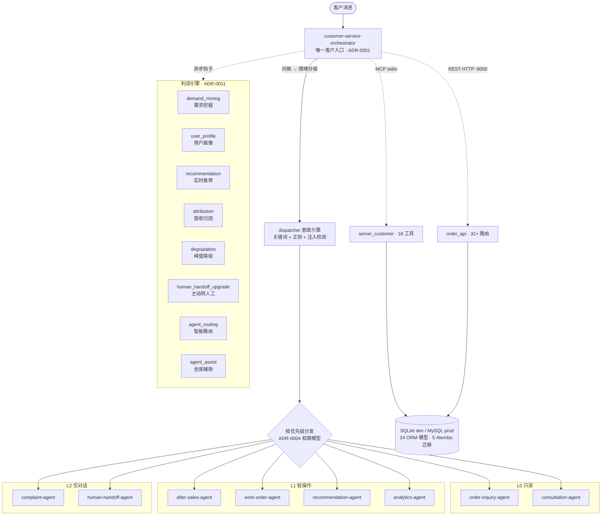

# 客服智能体 2.0 · AI 驱动客服利润引擎

> 从被动响应到主动创造营收 —— 多 Agent 编排 + 利润归因 + 实时推荐 + 峰值降级保护。


---

## 项目亮点

这是一个**独立设计并完成**的生产级后端项目，经历了两次重大架构迭代：

- **第一阶段（P1-P5）**：构建完整的多 Agent 客服编排系统，84 个测试，覆盖工单/退货/满意度/情绪升级/RAG 知识库等全生命周期。
- **第二阶段（利润引擎）**：在现有架构上叠加商业智能层，新增归因、推荐、需求挖掘、用户画像、智能路由、峰值降级等能力，测试数增至 **201**。

面试官最该关注的几个点：

- **多 Agent 编排架构**：1 个 Orchestrator 作为唯一客户入口，经内部意图引擎分发到 8 个子 Agent（6 个业务 Agent + 2 个利润引擎 Agent），子 Agent 永不直连客户（ADR-0001）。
- **三级权限模型防 prompt 注入**：L0 只读 / L1 轻操作 / L2 仅对话，权限只能降级不能升级，投诉与人工坐席 Agent 不接触业务系统（ADR-0004）。
- **AI 驱动利润引擎**：需求挖掘识别交叉销售机会 → 用户画像生成个性化推荐 → 漏斗追踪 → 四种归因模型（first_touch/last_touch/linear/time_decay）量化客服营收贡献（ADR-0011）。
- **异步钩子不阻塞客户响应**：ThreadPoolExecutor（max_workers=4）异步执行需求挖掘与归因记录，推荐生成同步但有 2s SLA 超时保护。
- **峰值负载智能降级**：负载 > 80% 或队列等待 > 30s 时自动跳过利润引擎内部工作，L0/L1/L2 业务 intent 永不降级，确保核心客服 SLA（ADR-0011）。
- **智能人机协同**：VIP + 低置信度主动转人工，坐席获得话术/知识/交叉销售辅助建议，智能路由按 skill + 用户价值 + 负载率分配（ADR-0011）。
- **确定性运行时可无 LLM 测试**：编排规则是可执行 Python，201 个测试在无 LLM 环境下跑完全部业务逻辑，覆盖率 76%。
- **框架中立适配器**：同一套编排逻辑既能经 MCP(stdio) 也能经 REST(HTTP) 暴露，传输层与业务逻辑完全解耦。
- **3 个真实并发缺陷的修复**：OrderedDict 竞争、SQLite 无 WAL、幂等键 TOCTOU，每个都附带针对性并发测试。
- **完整可观测性栈**：structlog 结构化日志 + Prometheus 指标 + Grafana 仪表盘 + Alertmanager 告警，request_id 全链路追踪。
- **11 份 ADR 架构决策记录**：每个关键决策都有背景、方案、权衡与结论，决策可追溯。

---

## 它解决什么问题

### 问题一：客服只能「被动响应」，不识别销售机会

传统客服系统只解决客户显性诉求（查订单、退款、投诉），不识别潜在的交叉销售/向上销售机会。本项目在 Orchestrator 主响应路径中嵌入利润引擎钩子，实时分析客户消息中的需求信号，生成个性化推荐并追踪漏斗转化。

### 问题二：客服贡献无法量化

运营无法回答"客服对话贡献了多少 GMV"。本项目实现四种归因模型（first_touch/last_touch/linear/time_decay），24 小时归因窗口，自动计算 ROI（归因营收 / 客服成本），并通过看板 API 对外暴露。

### 问题三：峰值负载下系统崩溃

大促期间咨询洪峰导致系统响应延迟甚至不可用。本项目实现智能降级策略：负载 > 80% 时自动跳过非核心的利润引擎工作（推荐、归因），但业务 intent（查订单、退款、投诉）永不降级，确保核心客服 SLA。

### 问题四：高价值客户体验差

VIP 客户在 AI 不确定其诉求时（intent_confidence < 0.7）仍被机器人反复追问。本项目实现主动转人工：VIP + 低置信度立即转人工，并推送 360° 画像、最近推荐、对话摘要给坐席，提升高价值客户体验。

---

## 系统架构



### 消息处理主循环（含利润引擎钩子）

```
handle_message(customer_message)
  1. 空消息              → 返回问候语
  2. 情绪分级            → L3(自杀/暴力)立即转人工; L2(投诉/监管)标记; 其他 L1
  3. 意图分析            → dispatcher.analyze() 返回多意图 + safety_notes
  4. 利润引擎钩子
       ├─ 需求挖掘（异步）    → ThreadPoolExecutor，识别交叉销售机会
       ├─ 用户画像查询        → 多平台身份合并、意图标签、价值分层
       ├─ 推荐生成（同步2s超时）→ opportunity_score > 0.6 触发个性化话术
       ├─ 归因记录（异步）    → 记录触点用于后续 ROI 计算
       └─ 降级检查            → 负载 > 80% 时跳过推荐/归因，业务永不降级
  5. 逐意图分发          → 按优先级: satisfaction > complaint > work_order
                          > human_handoff > after_sales > order_inquiry > consultation
  6. 结果整合            → _compose_reply()（含推荐话术，如未降级）
  7. 状态判定            → success / needs-info / partial / needs-human
  8. 需人工?             → 构建 handoff_package（含 360° 画像 + 推荐 + 摘要）
  9. 持久化对话状态       → DB + LRU 缓存(256, double-checked locking)
 10. 记录 usage 事件      → 含 mining_result / recommendations / opportunity_score
```

---

## 技术栈

| 层 | 技术 | 用途 |
|----|------|------|
| Agent 传输 | FastMCP (stdio) | 两个 MCP 服务器：customer-service（对外）+ order-server（内部只读） |
| REST API | FastAPI + Uvicorn | 32+ 路由，含 4 层限流、Prometheus 指标、利润看板 API |
| ORM | SQLAlchemy 2.0 | 24 个模型，Alembic 迁移 |
| 数据库 | SQLite (dev) / MySQL 8.0+ (prod) | 方言适配器隔离差异 |
| 日志 | structlog 26.x | ProcessorFormatter 桥接 stdlib logging，JSON/console 双模式 |
| 限流 | slowapi + LoadMonitor | 4 层分级限流 + 峰值负载监控 |
| 指标 | prometheus_client | 标准 exposition，多进程模式，新增 dashboard/attribution 指标 |
| 测试 | pytest + pytest-xdist | 并行加速（loadscope 分发），覆盖率 76% |
| CI/CD | GitHub Actions + GHCR | lint + audit + test matrix + migration smoke + 镜像构建 |

---

## 核心能力

### 第一阶段：客服全生命周期（14 个功能模块，全部 done）

| 模块 | 能力 |
|------|------|
| 多 Agent 编排 | Orchestrator + Dispatcher + 6 子 Agent，完整对话生命周期 |
| 工单生命周期 | ITIL 全流程：new → assigned → in_progress → pending → resolved → closed |
| 退换货退款 | pending → approved → in_transit → received → refunded → completed |
| 满意度调查 | 对话后 1-5 星，1-3 星自动创建低分回访工单并升级人工 |
| 情绪升级阶梯 | L1 编排器安抚 → L2 投诉 Agent → L3 立即转人工，零安抚 |
| 客户验证 | JWT + OTP，客户/订单 scope token |
| RAG 知识库 | sentence-transformers 嵌入检索，词法索引回退 |
| 用量分析 | 元数据级事件记录 + 业务日报 |

### 第二阶段：AI 驱动利润引擎（ADR-0011，全部 done）

| 模块 | 能力 |
|------|------|
| 需求挖掘 | 实时分析客户消息，识别交叉销售/向上销售机会，生成 opportunity_score |
| 用户画像 | 多平台身份合并、意图标签、价值分层（普通/VIP） |
| 实时推荐 | 基于画像与需求信号的个性化话术推荐，2s SLA 超时保护 |
| 营收归因 | 四种模型（first_touch / last_touch / linear / time_decay），24h 归因窗口 |
| ROI 计算 | 归因营收 / 客服成本（人力 ¥5/次 + AI ¥0.1/次），Top-5 Agent/话术排序 |
| 利润看板 API | `/api/v1/profit-dashboard` KPI + 营收 + 洞察，响应时间 < 2s |
| 峰值降级 | 负载 > 80% 跳过利润引擎工作，业务 intent 永不降级 |
| 主动转人工 | VIP + intent_confidence < 0.7 自动转人工，推送 360° 画像 |
| 坐席辅助 | 话术/知识/交叉销售建议，一键采纳并归因 |
| 智能路由 | 按 skill + 用户价值 + 负载率 + agent_id 字典序路由 |
| 漏斗追踪 | 推荐曝光 → 点击 → 加购 → 下单 → 支付全链路追踪 |

---

## 工程实践

### 测试体系

```
201 个测试用例 · 覆盖率 76% · 并行运行 ~25s
```

| 测试类型 | 关注点 |
|----------|--------|
| 端到端集成 | 编排全流程、REST API + 迁移 + /api/ready 503 |
| 安全控制 | OTP / RBAC / PII 脱敏 / 幂等 |
| 并发（4 个文件） | 对话状态隔离 / 编号无碰撞 / 幂等竞争 / SQLite WAL |
| 负载 | P95 响应时间 / 吞吐量（串行运行保证 QPS 准确） |
| 利润引擎 | 归因计算 / 推荐漏斗 / 降级策略 / 主动转人工 / 智能路由 / 坐席辅助 |
| 基础设施 | JSON 日志 / 限流 429 / Prometheus Content-Type |

每个 xdist worker 是独立 OS 进程，`DATABASE_URL`、引擎、缓存、限流器、指标注册表均自动隔离。

### CI/CD

- **lint**：ruff check + format + mypy（0 errors）
- **audit**：pip-audit 扫描已知漏洞，发现即失败
- **test matrix**：Python 3.10 / 3.11 / 3.12
- **migration smoke**：MySQL 8.4 上 up → down → up → seed → 全表断言（覆盖全部 24 张表）
- **CD**：main/tag 触发镜像构建推送 GHCR，非 root 用户运行

### 安全纵深

五层独立防御，每层可单独验证：

1. **RBAC**：角色 → 权限位，admin 通配 `*`，orchestrator 仅 `orchestrator:invoke`
2. **Verification scope**：客户 scope token 授权该客户所有订单；订单 scope 仅授权该订单
3. **幂等键**：SHA256(payload) 作 request_hash，并发竞争捕获 IntegrityError 回滚后返回胜者结果
4. **审计事件**：每次写操作落 AuditEvent
5. **PII 脱敏**：敏感字段出站前脱敏

### 架构决策记录

11 份 ADR（`docs/adr/`），每份记录背景、方案、权衡与结论：

| ADR | 主题 |
|-----|------|
| 0001 | 单一 Orchestrator 入口 |
| 0002 | 子 Agent 结构化自然语言通信协议 |
| 0003 | 三层情绪升级阶梯 |
| 0004 | 子 Agent 三级权限（L0/L1/L2） |
| 0005 | Scoped Verification + 业务日分析 |
| 0006 | 密钥管理与部署（Docker secrets） |
| 0007 | 数据库编号适配器（方言感知） |
| 0008 | 结构化日志（structlog + 桥接） |
| 0009 | API 限流策略（4 层分级） |
| 0010 | Prometheus 指标 + xdist 并行测试 |
| **0011** | **AI 驱动客服利润引擎** |

---

## 技术亮点深读

### 利润引擎异步钩子

`src/profit_engine_hooks.py` 在 Orchestrator 主响应路径中嵌入 ThreadPoolExecutor（max_workers=4）：

- **需求挖掘**与**归因记录**异步执行，不阻塞客户响应
- **推荐生成**同步但有 2s 超时保护（`Future.result(timeout=2.0)`），超时返回空列表
- 每个钩子用独立 `database.session_scope()` 会话，与调用方解耦
- 所有异常在 worker 内捕获并记录到 structlog，Future 永不向上抛出

**为何 ThreadPoolExecutor 而非 asyncio**：Orchestrator 主路径是纯同步代码，引入 asyncio 需在每个调用方（MCP / REST / direct tool）改造 event loop；ThreadPoolExecutor 的 `.result(timeout=...)` 可在同步上下文中实现 SLA 保护。

### 四种营收归因模型

`src/attribution_service.py` 实现四种归因模型，默认 `last_touch`：

| 模型 | 分配规则 | 适用场景 |
|------|---------|---------|
| `first_touch` | 100% 归属最早触点 | 评估「拉新」效果 |
| `last_touch` | 100% 归属最晚触点 | 评估「临门一脚」效果（默认） |
| `linear` | 触点均分 | 评估整链路贡献 |
| `time_decay` | 指数衰减，半衰期 7 天 | 越靠近转化的触点权重越高 |

- 归因窗口 24 小时，确保 `sum(attributed_amount) == total_order_amount`
- ROI 计算：归因营收 / 客服成本（人力 ¥5/次 + AI ¥0.1/次）
- 多模型对比通过 `?model=` 参数切换

### 峰值降级策略

`src/degradation.py` 提供 `degradation_policy` 单例，与 `src/rate_limit.py` 的 `LoadMonitor` 联动：

- 阈值（env 可覆盖）：并发请求 > 100、队列等待 > 30s、负载 > 80%
- `should_skip_recommendation()`：降级时跳过推荐生成（最贵且非客户必需）
- `should_use_profile_cache()`：降级时画像查询走缓存
- `should_delay_work_order()`：降级时非紧急工单延后
- `should_process(intent)`：**L0/L1/L2 业务 intent 永远处理**，仅 shed profit-engine 内部 intent

**关键设计**：客服系统首要职责是回应客户，利润引擎是「锦上添花」可降级，业务 intent 是「雪中送炭」不可降级。

### 确定性编排运行时

`orchestrator_runtime.py` 把原本写在 prompt 里的路由规则转成可执行 Python。全部业务逻辑——情绪分级、意图拆解、优先级排序、利润引擎钩子调用、状态判定——都能在无 LLM 的 CI 环境里跑测试。

### 方言感知编号器

同一 `NumberSequencer` 接口，两种实现：

- **InProcessSequencer**（SQLite）：线程锁 + DB max 查询，适配单进程测试
- **MysqlCounterSequencer**（MySQL）：`sequence_counters` 表 + `LAST_INSERT_ID` 原子自增，连接级隔离无锁，适配多进程生产

### 三个并发缺陷的修复

| 缺陷 | 现象 | 修复 |
|------|------|------|
| OrderedDict 竞争 | 多线程读写 `_CONVERSATION_STATES` 数据错乱 | `RLock` + double-checked locking，DB I/O 放锁外 |
| SQLite 无 WAL | 并发写直接 `database is locked` | event listener 对每个连接设 WAL + busy_timeout |
| 幂等 TOCTOU | 并发请求同时查不到键、同时插入 | 捕获 `IntegrityError`，回滚后重查返回胜者结果 |

### 结构化日志的零侵入迁移

`ProcessorFormatter` 的 `foreign_pre_chain` 含 `merge_contextvars`，使业务代码里已有的 `logging.getLogger(__name__)` 调用自动获得 `request_id`——迁移过程中无需改动任何业务日志语句。

---

## 项目结构

```
src/                         33 个源文件（含利润引擎扩展）
├── orchestrator_runtime.py    核心编排运行时（确定性 Python，999行）
├── dispatcher.py              意图引擎（规则 + 正则 + 注入检测）
├── orchestrator_mcp_tool.py   MCP 适配器
├── orchestrator_api.py        REST 适配器
├── order_api.py               FastAPI 应用，32+ 路由（含利润看板）
├── service_layer.py           RBAC + PII + 审计 + 状态机
├── security.py                认证 / RBAC / OTP / 幂等全集
├── models.py                  24 个 ORM 模型（含利润引擎 9 张表）
├── database.py                引擎/会话工厂，方言适配
├── numbering.py               编号适配器（SQLite / MySQL）
├── profit_engine_hooks.py     异步钩子（ThreadPoolExecutor，4 workers）
├── attribution_service.py     四种归因模型 + ROI 计算
├── demand_mining_service.py   需求挖掘（交叉销售机会识别）
├── recommendation_service.py  推荐服务（个性化话术）
├── recommendation_agent.py    推荐 Agent（L1 权限）
├── analytics_agent.py         分析 Agent（L1 权限）
├── user_profile_service.py    用户画像（多平台身份合并）
├── agent_assist_service.py    坐席辅助（话术/知识/交叉销售建议）
├── agent_routing.py           智能路由（skill + 价值 + 负载）
├── human_handoff_upgrade.py   主动转人工（VIP + 低置信度）
├── degradation.py             峰值降级策略
├── kb_service.py              FAQ RAG 检索
├── analytics_service.py       用量分析 + 日报
├── log_config.py              structlog 配置
├── request_logging.py         纯 ASGI 请求日志中间件
├── rate_limit.py              slowapi 4 层限流 + LoadMonitor
├── metrics.py                 prometheus_client 指标
├── config.py                  RuntimeConfig（冻结 dataclass + Docker secrets）
└── server*.py                 两个 MCP 服务器入口
tests/                       26 个测试文件，201 个测试用例
docs/adr/                    11 份架构决策记录
monitoring/                  Prometheus + Grafana + Alertmanager 配置
alembic/versions/            5 个数据库迁移（含利润引擎 schema）
.github/workflows/           CI（lint+audit+test matrix+迁移烟雾）+ CD（GHCR）
```

---

## 快速开始

### 前置要求

- Python 3.10+
- [uv](https://docs.astral.sh/uv/)（推荐）或 pip + venv

### 安装与初始化

Windows（PowerShell / CMD）：

```powershell
.\init.cmd --check-only --skip-tests   # 仅环境检查
.\init.cmd                              # 完整初始化（依赖 + 迁移 + 健康检查 + 测试）
```

POSIX：

```bash
bash init.sh --check-only --skip-tests
bash init.sh
```

`init` 会依次完成 6 个阶段：Python 版本 → 依赖安装 → 数据库迁移 → REST 健康检查 → MCP 启动烟雾 → pytest。

### 单独运行服务

```bash
# REST API（订单查询 / 工单 / 退货 / 利润看板等）
uvicorn order_api:app --reload --port 8000

# 运行测试
uv run pytest tests/ -q
uv run pytest tests/ -q -n auto --dist=loadscope -m "not load"   # 并行
uv run pytest tests/test_load_orchestrator.py -m load             # 负载（串行）
```

### Docker 部署

```bash
cp .env.example .env
docker compose -f docker-compose.yml up -d              # 开发栈（MySQL）
docker compose -f docker-compose.prod.yml up -d         # 生产栈（Docker secrets）
docker compose -f docker-compose.monitoring.yml up -d   # 监控栈（Prometheus+Grafana+Alertmanager）
```

生产配置通过 `.env` 驱动，`APP_ENV=production` 会阻断开发 OTP、默认 dev JWT secret、缺失 OIDC JWKS 与 SQLite 生产库。

---

## 演进路线

项目按两个阶段迭代推进：

### 第一阶段：客服核心系统（P1-P5）

| 阶段 | 主题 | 关键产出 |
|------|------|----------|
| P1 | 生产部署加固 | MySQL 迁移、密钥管理、监控栈、CI/CD（ADR-0006/0007） |
| P2 | 并发与负载测试 | 修复 3 个并发 bug，22 个新测试，3 层并发测试体系 |
| P3 | CI 与工具加固 | 覆盖率跟踪、pip-audit、全表迁移烟雾、OpenAPI 文档、异常收窄 |
| P4 | 结构化日志 + 限流 | structlog + contextvars 传播、slowapi 4 层限流（ADR-0008/0009） |
| P5 | Prometheus + 并行测试 | prometheus_client 标准库、pytest-xdist 5x 加速（ADR-0010） |

### 第二阶段：AI 驱动利润引擎

| 主题 | 关键产出 |
|------|----------|
| 需求挖掘与用户画像 | 多平台身份合并、意图标签、价值分层、交叉销售机会识别 |
| 实时推荐与漏斗追踪 | 个性化话术推荐、2s SLA 超时保护、全链路漏斗追踪 |
| 营收归因与 ROI | 四种归因模型、24h 归因窗口、Top-5 Agent/话术排序 |
| 利润看板 API | `/api/v1/profit-dashboard` KPI + 营收 + 洞察，< 2s 响应 |
| 峰值降级保护 | 负载 > 80% 跳过利润引擎工作，业务 intent 永不降级 |
| 智能人机协同 | VIP 主动转人工、坐席辅助建议、智能路由 |
| 测试覆盖 | 新增 117 个测试，总计 201 个，覆盖率维持 76% |

全部阶段已完成，201 个测试通过，覆盖率 76%，11 份 ADR，无活跃阻塞项。

---

## 联系方式

仓库：<https://github.com/K-boy-666/Customer-Service-Agent>

如果你对架构决策、利润引擎实现、并发修复或可观测性的细节感兴趣，`docs/adr/` 与 `progress.md` 里有完整的推理与验证过程。
